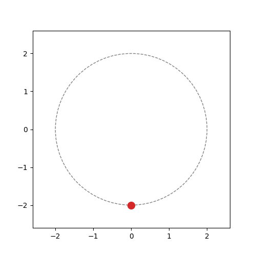
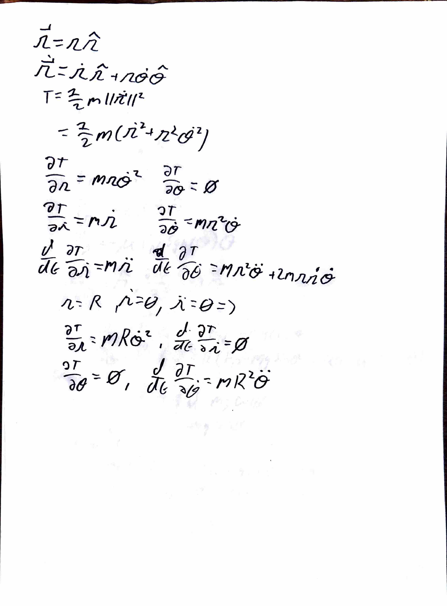
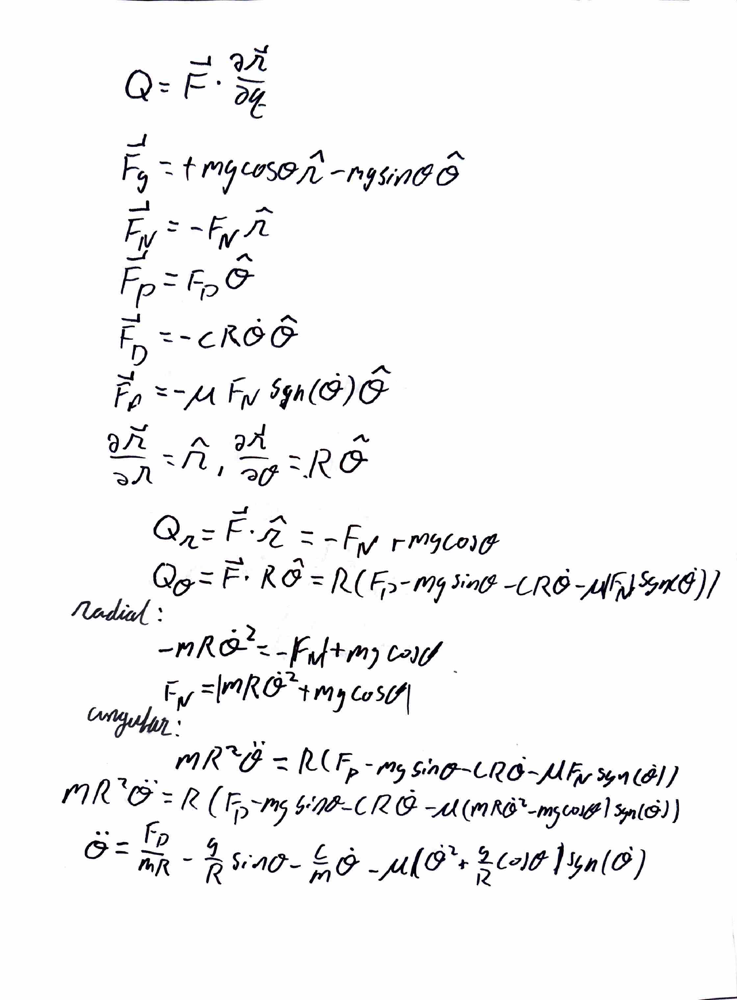
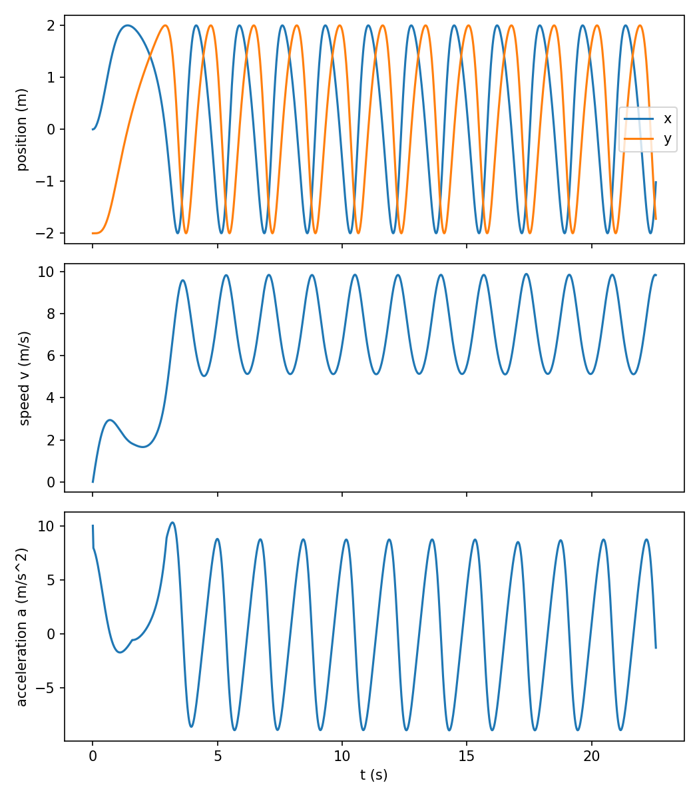

# Vertical Loop Motion Solver

Solves the motion of an object locked to a vertical circular track of radius $R$. The object feels a constant propulsive force, linear drag, and friction proportional to the normal force. The script animates the motion, plots position, speed, acceleration, and the generalized forces against time, and finds the largest g-force the object reaches once its speed stops growing loop to loop.



## Mathematical model

Euler-Lagrange equation, with propulsion, drag, and friction as generalized forces, solved for $\ddot{\theta}$:



**Note:** one error on page 2, $$mR^2\ddot{\theta}$$ should have a plus ($$+$$) $$mg\cos\theta$$ term rather then a minus ($$-$$) term.

$\theta$ is measured from the bottom of the loop. The normal force comes from the radial balance:

$$F_N = m\left(R\dot{\theta}^2 + g\cos\theta\right)$$

$$\ddot{\theta} = \frac{F_p}{mR} - \frac{g}{R}\sin\theta - \frac{c}{m}\dot{\theta} - \mu\left|\dot{\theta}^2 + \frac{g}{R}\cos\theta\right| \mathrm{sgn}(\dot{\theta})$$

Generalized forces are the tangential forces times $R$ (N·m).

g-force is $F_N/(mg)$.

## Implementation

- **Solver:** `solve_ivp` integrates $[\dot{\theta}, \ddot{\theta}]$. $\mathrm{sgn}(\dot{\theta})$ is smoothed to $\tanh(\dot{\theta}/\epsilon)$ so the solver doesn't stall each time $\dot{\theta}$ crosses zero.
- **Time scale:** time windows are in units of $\tau = \sqrt{R/g}$, so they work for any loop size.
- **Critical force:** the object starts from rest at the left vertical section ($\theta = -\pi/2$). `brentq` finds the $F_p$ where the smallest $F_N$ over the top half of the first loop is exactly zero.
- **Events:** each first-loop run stops when the object clears the top half or stalls.
- **Asymptotic g-force:** the critical case runs for $1000\tau$, and the max of $F_N/(mg)$ is taken over the second half.

## Results

Defaults: $m = 1$ kg, $R = 2$ m, $g = 9.81$ m/s², $c = 0.5$ kg/s, $\mu = 0.2$, $F_p = 10$ N. $F_p$ applies to the animated run only; the critical case solves for its own.

| Quantity | Value |
| --- | --- |
| Asymptotic max g-force | 5.69 g |

### Kinematics

Position ($x$ and $y$), speed, and tangential acceleration for the animated run ($F_p = 10$ N, starting from rest at the bottom).



### Generalized forces

Propulsion, gravity, linear drag, and friction, each as a generalized force $Q_\theta$ in N·m.


## Limitations

- The object is a point mass locked to the track.
- Friction has no static component.
- With $c = 0$ and $\mu = 0$ there is no asymptotic state, and the script raises an error.
- The animated run uses $F_p = 10$ N. Larger $m$, $g$, $\mu$, or $R$ need a larger $F_p$ to loop.

## Usage

Requires `numpy`, `scipy`, and `matplotlib`.

```bash
python circular_motion.py
```

Prints `max g-force = 5.69 g` and saves `circular_motion.gif`, `kinematics.png`, and `generalized_forces.png`.
