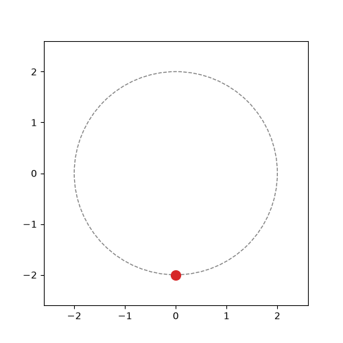
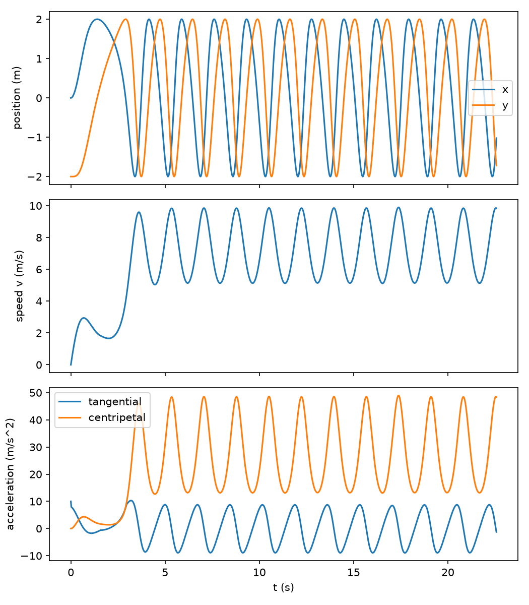
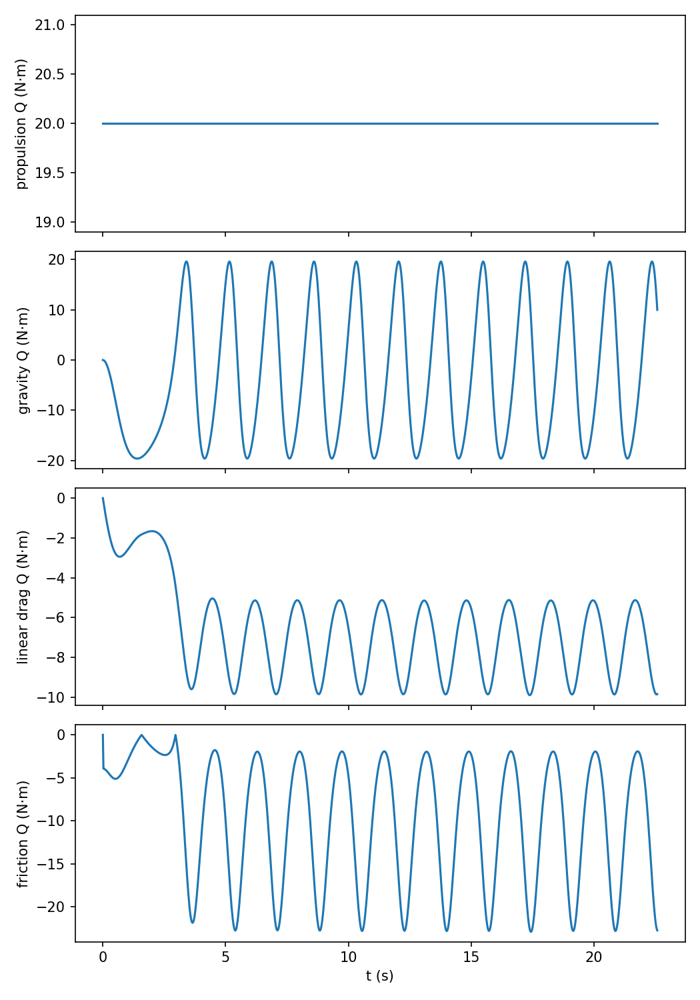

# Analytical_Mechanics_Numerical_Methods_Projects

## Project 1: Vertical Loop Motion Solver

Solves the motion of a bead locked to a vertical circular wire of radius $R$ with a constant propulsive force, linear drag, and friction proportional to $|F_N|$. The bead cannot leave the wire. The script animates the default parameters, plots position, speed, acceleration, and the generalized forces against time, then finds the largest g-force the bead reaches once its speed stops growing loop to loop in the critical case.



### Mathematical model

Derivation of the equation of motion:

[Derivation, page 1](project_1/derivation_pg1.png)

[Derivation, page 2](project_1/derivation_pg2.png)

**Note:** one error on page 2, $mR^2\ddot{\theta}$ should have a plus ($+$) $mg\cos\theta$ term rather than a minus ($-$) term.

$\theta$ is measured from the bottom of the loop. 

$$F_N = m\left(R\dot{\theta}^2 + g\cos\theta\right)$$

$$\ddot{\theta} = \frac{F_p}{mR} - \frac{g}{R}\sin\theta - \frac{c}{m}\dot{\theta} - \mu\left|\dot{\theta}^2 + \frac{g}{R}\cos\theta\right| \mathrm{sgn}(\dot{\theta})$$

$F_N$ is the inward normal. Friction uses $|F_N|$ because the bead stays on the wire even if $F_N$ would change sign; a coaster would have left the track at $F_N = 0$. Generalized forces are the tangential forces times $R$ (N·m).

g-force is $F_N/(mg)$.

### Implementation

- **Solver:** `solve_ivp` integrates $[\dot{\theta}, \ddot{\theta}]$. $\mathrm{sgn}(\dot{\theta})$ is smoothed to $\tanh(\dot{\theta}/\epsilon)$ so the solver doesn't stall each time $\dot{\theta}$ crosses zero.
- **Time scale:** time windows are in units of $\tau = \sqrt{R/g}$, so that they can work for any loop size.
- **Critical force:** the bead starts from rest at the left vertical section ($\theta = -\pi/2$). `brentq` finds the $F_p$ where the smallest $F_N$ over the top half of the first loop is exactly zero (the grazing-coaster diagnostic).
- **Events:** each first-loop run stops when the bead clears the top half or stalls.
- **Asymptotic g-force:** each lap is $+2\pi$ in $\theta$ from the left vertical. Peak $F_N/(mg)$ is compared lap to lap; when consecutive laps agree, that peak is the reported g-force. The run is capped at $1000\tau$.
- **Figures:** GIF and plots use the default parameters ($F_p = 10$ N, rest at the bottom). The critical-force search runs after that.
- **Automated tests:** `project_1/test_1.py` checks the model against physics that can be worked out by hand, using pytest.

### Results

Defaults: $m = 1$ kg, $R = 2$ m, $g = 9.81$ m/s², $c = 0.5$ kg/s, $\mu = 0.2$, $F_p = 10$ N, starting from rest at the bottom. Those values are used to animate the motion and to plot position vs time, speed vs time, acceleration vs time, and all generalized forces (separately) vs time.

#### Max asymptotic g-force

A separate scenario starts from rest at a vertical section of track and makes it over the top of the loop with a normal force of zero the first time around, so that if it wasn't locked to the track like a rollercoaster, it would make it around the loop without losing contact.

Given those same conditions and being allowed to continue with the same propulsive force, the largest g-force the vehicle attains once in an asymptotic condition where loop by loop it is no longer gaining speed is 5.69 g.

| Quantity | Value |
| --- | --- |
| Largest g-force once loop by loop it is no longer gaining speed | 5.69 g |

#### Kinematics

Position vs time, speed vs time, and acceleration vs time (tangential $R\ddot{\theta}$ and centripetal $R\dot{\theta}^2$).



#### Generalized forces

All generalized forces separately vs time: propulsion, gravity, linear drag, and friction, each as $Q_\theta$ in N·m.



### Verification

`project_1/test_1.py` runs four checks:

| Test | Checks |
| --- | --- |
| Normal force at the top | $F_N = 0$ when $R\dot{\theta}^2 = g$ at $\theta = \pi$. |
| Work-energy | The change in mechanical energy equals the work done by propulsion, drag, and friction, to 1 part in $10^5$ |
| Asymptotic convergence | Consecutive laps have the same peak g-force, so speed has stopped growing loop to loop |
| First-loop grazing | At $F_{p,\mathrm{crit}}$, the smallest $F_N$ on the top half of the first loop is zero and not negative |

### Limitations

- The object is a point mass locked to the wire. $F_N < 0$ is allowed by the constraint; it is only used as a diagnostic when finding $F_{p,\mathrm{crit}}$.
- Friction has no static component.
- With $c = 0$ and $\mu = 0$ there is no asymptotic state, and the script raises an error.
- A larger $m$, $g$, $\mu$, or $R$ would need a larger $F_p$ to loop.

### Usage

Requires `numpy`, `scipy`, `matplotlib`, `pillow`, and `pytest`.

```bash
cd project_1
python Project_1.py
```

Prints `max g-force` for the critical case and saves `circular_motion.gif`, `kinematics.png`, and `forces.png` from the default run in `project_1/`.

### Running tests

From the repository root:

```bash
pytest -v
```
